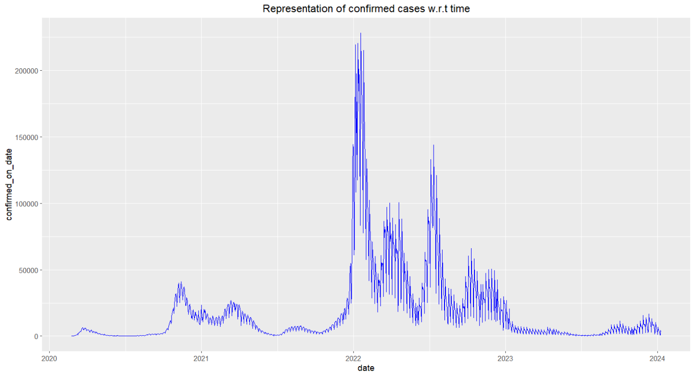

# Project Time Series Covid2019 Data

## Author : 
- Aurélien Pardo [Linkedin](www.linkedin.com/in/aurélien-pardo-24a02324b).
- Julien Ducrey [Linkedin](https://www.linkedin.com/in/julien-ducrey-21jd/) and [Github](https://github.com/jducrey).

## Programming Language

**R**. Output Format R Markdown.

## Description

This repository contains an analysis and visualization of time-series data related to the COVID-19 pandemic, with a focus on the evolution of key indicators (number of cases, deaths, recoveries, etc.) over time. The project aims to provide insights into trends and facilitate exploration of the pandemic’s impact on both global and regional scales.

## Contents

- **Data**: Time-series datasets related to COVID-19, aggregated daily and by region or country.
- **Data Processing Scripts**: R mardown notebook for data extraction, data cleaning and transformation to make the data suitable for analysis.
- **Descriptives Statistics**: General insights (sum, mean, etc.) on data.
- **Visualizations** : Graphs and charts illustrating trends in COVID-19 cases, recovery rates, and death rates.
- **Predictive Models**: Time Series : STL Decomposition.

## Project Goals

- Analyze pandemic data across specific periods and for different geographic regions (France,Italy,Germany).
- Identify trends and case peaks, and observe the impact of different waves of the pandemic.
- Implement time-series models to predict future case numbers.

## Data Sources
- Data source: Data from [COVID-19 Data](https://disease.sh/).
- Author: 	[Johns Hopkins University](https://coronavirus.jhu.edu/map.html) .
  
